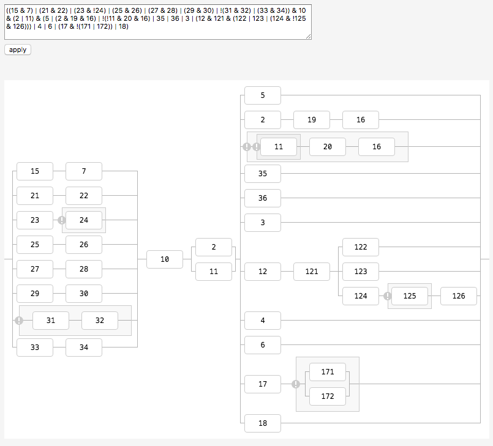

# 规则可视化

将形如 `1 & 2 & (3 | 4)` 这样的规则转为可视化图形。

## 使用方法

```javascript
rulev = new RuleVisualizer($RULE, $ELEMENT, $OPTIONS);
```

各项参数含义如下：

- `$RULE` *string* 具体的规则，形如 `1 & 2 & (3 | 4)`
- `$ELEMENT` *HTMLElement* or *jQueryNode* 容器元素
- `$OPTIONS` *object* [可选参数] 配置项

其中 `$OPTIONS` 可包含以下内容，都是可选：

 - `node_width` 节点宽度，默认为 60
 - `node_height` 节点高度，默认为 30
 - `styles` 可以给指定节点自定义 CSS 样式
 - `ready` 渲染完成后的回调函数

示例如下：

```javascript
rulev = new RuleVisualizer($('#user-rules').val(), $('#rule-wrapper'), {
    node_width: 30,
    node_height: 20,
    styles: {
        '2': {'background': '#f99'},
        '3': {'background': '#42985d'},
        '4': {'background': '#a829f3', 'border': '1px solid #00f'}
    },
    ready: () => {
        // on rendered
        console.log('height:', $('#rule-wrapper').height());
    }
});
```

效果如下图：



使用方法见 [demo/test.html](demo/index.html)。
